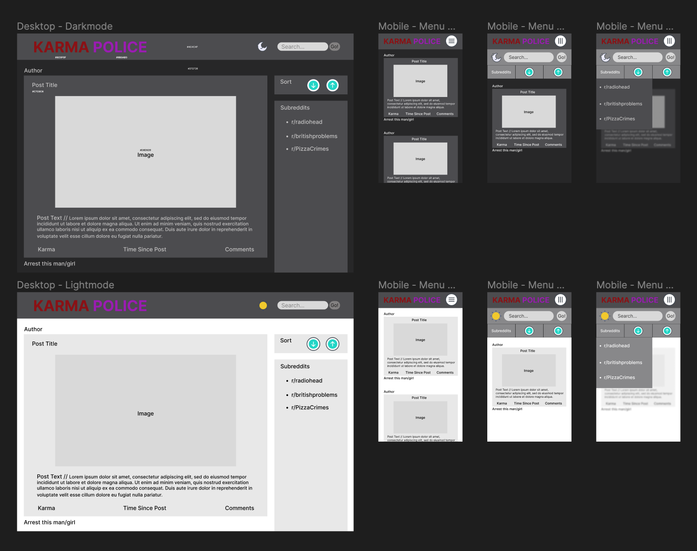

# Karma Police

Karma Police is a Reddit client that allows users to browse posts from a selected subreddit and sort them based on the user's total karma score.

## Technologies Used

- **Git version control:** Version control system for tracking changes in source code during development.
- **GitHub Pages:** Static site hosting service for deploying and showcasing web applications.
- **GitHub Actions:** CI/CD platform for automating workflows and tasks in software development.
- **Jest:** JavaScript testing framework for writing and running tests.
- **Selenium:** End-to-end testing library for automating front end testing.
- **React:** JavaScript library for building user interfaces.
- **React Router Dom:** Routing library for single-page applications in React.
- **React Redux:** Official Redux bindings for React for state management.
- **Styled Components:** CSS-in-JS library for styling React components.
- **React Icons:** Library of popular icon packs for React applications.
- **Figma:** An interface design tool used for wireframing.

## Features

- Fetches and displays posts from a selected subreddit.
- Sorts posts based on the user's total karma score (ascending or descending).
- Allows users to "arrest" specific Reddit users, preventing their posts from being displayed.
- Provides a responsive and intuitive user interface for easy navigation and interaction.
- Supports dark and light themes for personalized user experience.
- Mobile view features a clean, compact menu system with animations.

## Wireframes & Initial Design

I used [Figma](https://www.figma.com/) to wireframe both the desktop and mobile versions of the app. I later deviated from this a little as I made further decisions during development, such as the colour scheme, fonts, icons and some styling preferences. For example, I found there wasn't enough contrast in the original colour scheme to make the text easy to read and the app accessible.

## Future Work

I was keen to avoid scope creep, so kept this project within the brief outlined on Codecademy. However if I were to develop this app further, I'd like to add the following features:

- Loading animations for cards and their components.
- Implement subreddit searches.
- Allow users to add their own Reddit account and fetch subreddits they are subscribed to.
- Switch to Reddit's official API.
- Add karma awarding (requires official Reddit API).
- Add poll voting & post commenting.
- Store app state in user's session storage.
- Ensure Reddit videos have sound (requires official Reddit API).

## Getting Started

To view Karma Police in your browser, visit: <https://jason-duffy.github.io/karma-police/>

To run Karma Police on your local machine, follow these steps:

1. Clone the repository: `git clone https://github.com/jason-duffy/karma-police.git`
2. cd to the root directory
3. Install the dependencies: `npm install`
4. Start the development server: `npm start`
5. Open your browser and visit: <http://localhost:3000>

## Testing

To run automated tests on your local repo, follow these steps:

1. cd to the root directory
2. To run the unit/integration test suite: `npm test`
3. To generate a test coverage report: `npm run test-coverage`
4. To run end-to-end tests with Selenium: `npm run test-end-to-end`

## License

This project is licensed under the [MIT License](./license.txt).